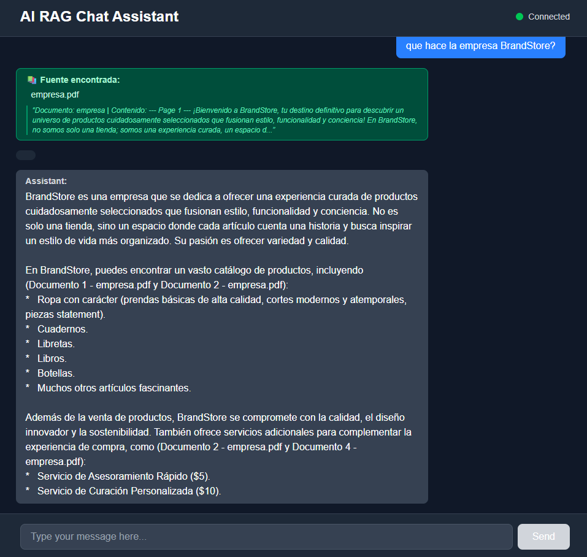
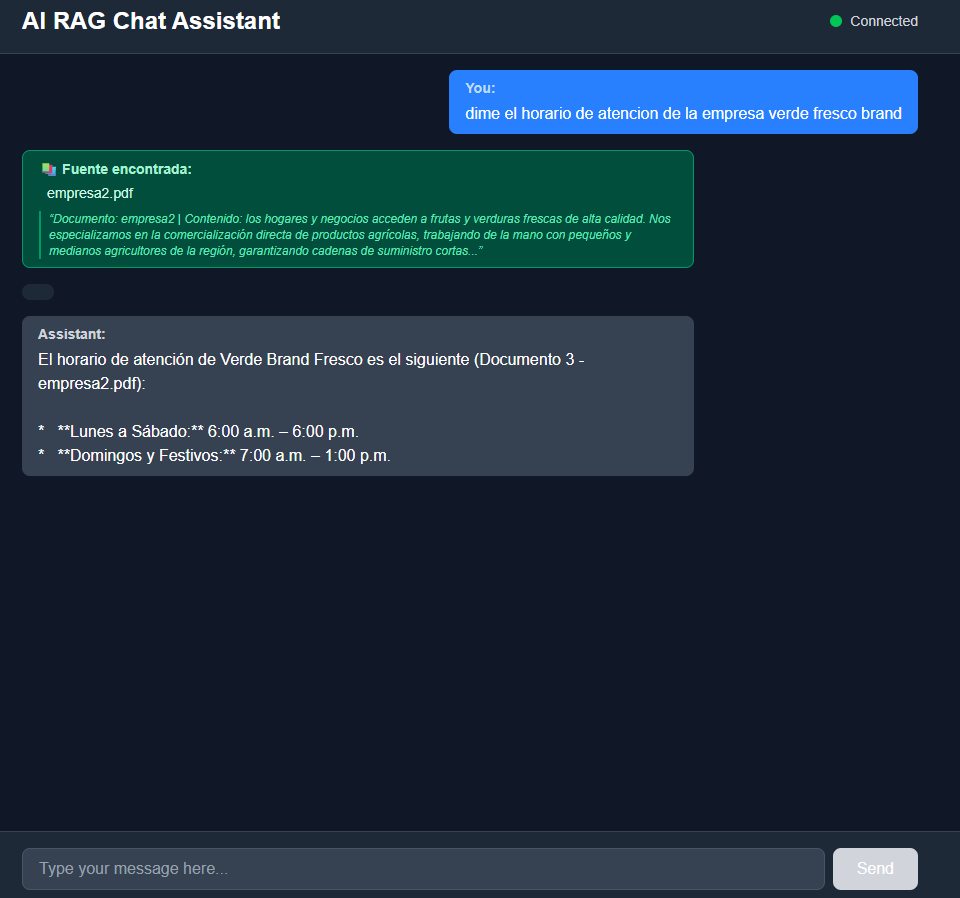
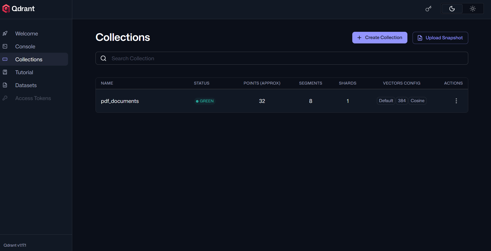
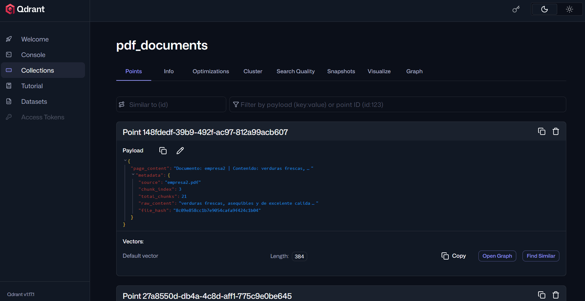

# FastAPI LangChain RAG PDFs Qdrant 


RAG (Retrieval-Augmented Generation) of PDFs with Qdrant using LangChain and FastAPI

<p align="center">
  
</p>

<p align="center">
  
</p>


---
# Qdrant Setup

Docuemntation oficial of [Qdrant](https://qdrant.tech/documentation/quickstart/)

Download Qdrant in docker:
```powershell
docker pull qdrant/qdrant
```

💾 (Optional) Persist data

To not lose data when shutting down the container:

```powershell
docker run -d --name qdrant_container -p 6333:6333 -p 6334:6334 -v ${PWD}/qdrant_storage:/qdrant/storage qdrant/qdrant
```

🔍 4. Verify that it is running
```powershell
docker ps
```


You should see qdrant_container active.

Test Qdrant from the browser
Open:

localhost:6333/dashboard

<p align="center">
  
</p>


<p align="center">
  
</p>


### Prerequisites

- Python 3.11 or higher
- [uv](https://docs.astral.sh/uv/) - Ultra-fast Python package manager


## Installation

### Prerequisites

- Python 3.11 or higher


**Creation .env file** with the following content:

```
GOOGLE_API_KEY=your_google_api_key
```

### Quick Start with UV

```bash
# Clone the repository
git clone <repository-url>
cd <repository-url>

# Install dependencies
uv sync

# Run 
uv run python main.py
```


### Installation steps

1. **Clone or navigate to the project**:

2. **Install dependencies with uv**:

```bash
# Create virtual environment and install dependencies
uv sync
```

> **Note**: The project uses `uv` for fast dependency management. If you prefer pip, you can generate requirements.txt first:

```bash
uv pip compile pyproject.toml -o requirements.txt
pip install -r requirements.txt
```


### Installation steps

1. **Clone or navigate to the project**:


2. **Install dependencies with uv**:

```bash
# Create virtual environment and install dependencies
uv sync
```

Create the project with uv without initializing git use --bare

```python
uv init --python 3.11 --bare
```

But create the file .python-version

Option A: Using requirements.txt

```python
# Generate requirements.txt from pyproject.toml
uv pip compile pyproject.toml -o requirements.txt

#if use pip :
pip install -r requirements.txt 

# Install dependencies from requirements.txt

uv add -r requirements.txt
```

Option B: Direct sync

```python
uv sync
```


## 🎯 Usage

### Start the application

```bash
# Activate virtual environment
.venv\Scripts\activate  # Windows
source .venv/bin/activate  # macOS/Linux
```

or / and

```bash
# Run application for not open browser inmediatly
uv run python main.py
```


### 📄 License

This project is licensed under the MIT License - see the [LICENSE](LICENSE) file for details.

---

## 👨‍💻 Author / Autor

**Diego Ivan Perea Montealegre**

- GitHub: [@diegoperea20](https://github.com/diegoperea20)

---

Created by [Diego Ivan Perea Montealegre](https://github.com/diegoperea20)